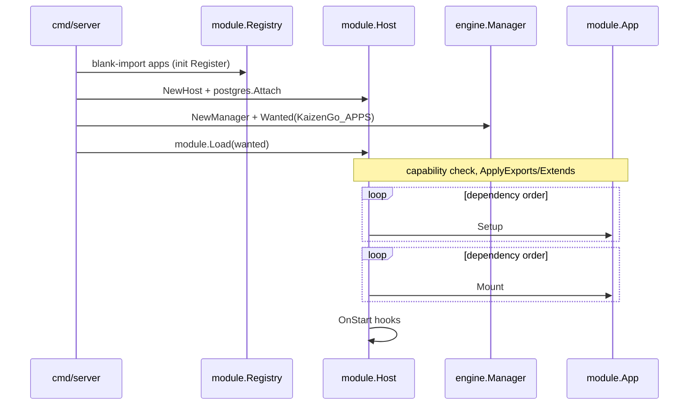
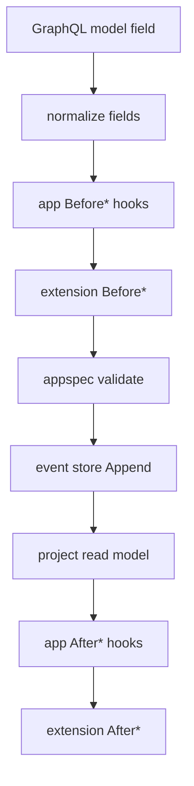
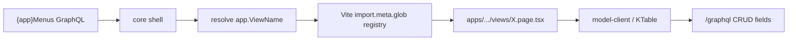

# Internals

How KaizenGo’s host and SDKs are structured and how data moves through the process. Trees, lifecycles, and data-flow maps for the host.

SDK usage recipes: [Go SDK](go-sdk.md) · [Solid SDK](solid-sdk.md). Day-to-day workflow: [Development](../development/index.md).

| Guide | Contents |
|-------|----------|
| [This page](index.md) | Layer map, project tree, boot & load lifecycle, mutation & UI data flows |
| [Go SDK](go-sdk.md) | Engine, hooks runtime, events/projections, extension dispatch, package map |
| [Solid SDK](solid-sdk.md) | View registry, Vite aliases, model-client ↔ GraphQL naming |

## Layer map

```text
cmd/server          → process entry, Host, Load, HTTP listen
internal/module     → App interface, registry, Host bag, GraphQL registry
internal/engine     → app.yaml → CRUD, GQL, hooks, install manager
internal/extension  → global lifecycle handlers, exports/extends
internal/events     → event store + projections (+ pgstore)
internal/platform   → i18n, time, config, postgres, search
internal/auth       → session middleware / principal
packages/sdk-go     → appspec, acl, i18n, views, codegen (portable contracts)
packages/sdk-solid  → UI kit, model client, identity/search clients
apps/<name>         → app.yaml + module.go + views + migrations
```

| Layer | Owns | Must not own |
|-------|------|--------------|
| `internal/` | Kernel, engine, lifecycle, middleware | Per-app business rules |
| `packages/sdk-go` | Spec/ACL/i18n contracts for apps | Host wiring / process kernel |
| `packages/sdk-solid` | Shared UI + GraphQL clients | Product screens |
| `apps/` | Spec, hooks, views, migrations | Platform kernel forks |

→ Calling these from app code: [Development](../development/index.md)

## Project tree

```text
kaizengo/
  cmd/
    server/           # HTTP process: Host, Postgres, auth middleware, Load
    godino/           # codegen (types, .pot)
    kaizengo/         # CLI scaffold
  internal/
    module/           # Register, Host, Load, GQL registry, nav
    engine/           # Options/New, SetupEvents, modelService, Manager
    app/              # locales, installed-apps store, nav helpers
    extension/        # Register / Run / ApplyExports|Extends
    events/           # Store interfaces
    events/pgstore/   # Postgres event store
    projection/       # runners + read-model sinks
    gql/              # RequireAction / RequirePrincipal
    auth/             # session cookie → Principal
    platform/         # postgres, i18n, time, search, config, drivers
  packages/
    sdk-go/
      appspec/        # YAML load + validate
      acl/            # evaluate / match / Authorizer
      i18n/           # facade over platform catalogs
      views/          # menu/view DTOs
      codegen/        # godino helpers
    sdk-solid/
      ui/             # KTable, KForm, t(), model-client
      identity/       # UserPicker, fetchUsers
      search/         # SearchBar
      spa-config/     # shared Vite
  apps/
    apps.go           # blank-imports every bundled app
    <name>/
      app.yaml
      module.go
      models/         # optional spec.yaml + hooks.go
      views/          # *.page.tsx
      migrations/
      locale/
```

## Boot and load lifecycle



`cmd/server/main.go` wires the host, then loads apps:

1. Blank-import `kaizengo/apps` so every bundled app’s `init()` runs `module.Register`
2. Create `module.Host` (router + service bag + GraphQL registry)
3. Connect Postgres and attach it to the host
4. Install session middleware (looks up `auth` at request time)
5. Resolve **wanted** apps (`KaizenGo_APPS` or installed + `autoInstall`)
6. `module.Load` — capability check → Setup (dep order) → Mount (dep order)

```go
host := module.NewHost(r, slog.Default())
db, err := postgres.Connect(context.Background(), config.PostgresDSN())
postgres.Attach(host, db)

mgr := engine.NewManager(host, module.Default, store)
wanted, err := mgr.Wanted(context.Background(), module.ParseAppList(os.Getenv("KaizenGo_APPS")))
if err := module.Load(host, module.Default, wanted); err != nil {
	log.Fatal(err)
}
```

### `module.App` contract

```go
type App interface {
	Manifest() Manifest
	Setup(host *Host) error
	Mount(host *Host) error
}
```

`Load` resolves dependency order, validates `provides` / `uses`, applies cross-app `exports` / `extends`, then runs **all** Setup before any Mount.

### Host bag

Apps share services through `Provide` / `Lookup` — they do not import each other’s packages for runtime wiring:

```go
host.Provide("my.service", svc)
raw, ok := host.Lookup("my.service")
host.GQL.RegisterQuery("myField", &graphql.Field{ /* … */ })
host.RegisterNav(module.NavEntry{ID: "demo", Route: "demo"})
```

→ Writing a one-liner app: [Development → Go](go-sdk.md)

## Mutation data flow

When GraphQL calls `createHellospecGreeting` (or any engine model mutation):



```text
normalize → app Before* → extension Before*
→ validate → append event → project read model
→ app After* → extension After*
```

ACL for model CRUD is enforced inside `modelService` (`packages/sdk-go/acl` via the `permissions` host service). Details: [Go host](go-sdk.md) · [ACL](../acl.md).

→ Authoring hooks: [Development → Go → lifecycle hooks](go-sdk.md#lifecycle-hooks)

## Spec → runtime (engine Setup)

`engine.New` returns a `module.App`. During `Setup` it:

1. Loads the appspec (`apps/<name>/app.yaml`)
2. Loads `.po` catalogs and registers shell nav
3. Opens the shared Postgres pool and event store (`SetupEvents`)
4. Registers CRUD GraphQL + `{app}Views` / `{app}Menus`
5. Provides the model registry on the host (`ModelsKey(appName)`)

## Frontend data flow



There is **one** shell SPA (`apps/core/spa`). Pages under `apps/<name>/views/*.page.tsx` are discovered at build time and keyed as `{app}.{ViewName}`.

→ Writing pages: [Development → Solid](solid-sdk.md) · registry details: [Solid shell](solid-sdk.md)

## Worked map: hellospec

| File | Role in the flows above |
|------|-------------------------|
| `apps/hellospec/app.yaml` | Spec → engine Setup |
| `apps/hellospec/module.go` | `engine.New` + `module.Register` |
| `apps/hellospec/hooks.go` | App Before*/After* on the mutation path |
| `apps/hellospec/views/*.page.tsx` | Shell registry → UI |
| `apps/hellospec/migrations/` | Event store + `greetings_read` projection target |

## Related reference

- [Apps system](../apps.md) — install / upgrade / Host details
- [Auth](../auth.md) · [ACL](../acl.md) · [GraphQL](../graphql.md) · [Capabilities](../capabilities.md)
